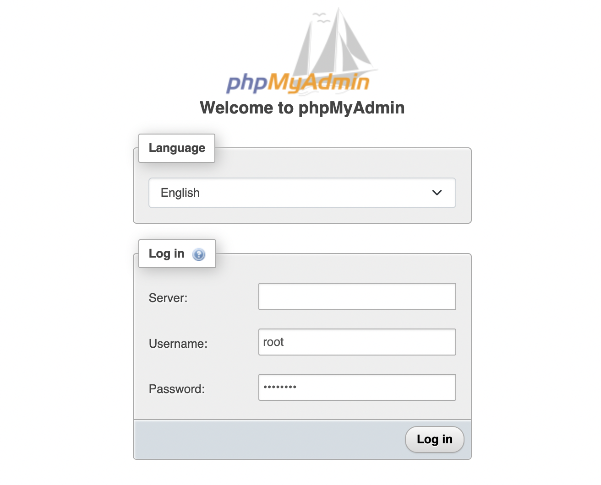

# MySQL , PHPMyAdmin Docker-Compose

## installation

1 download the repose files
```bash
git clone git@github.com:abdallhsamy/mysql_phpmyadmin_docker.git
```
2 navigate to the downloaded folder
```bash
cd mysql_phpmyadmin_docker
```

2 pull and install the docker containers

```bash
docker-compose up -d
```
3 run phpmyadmin using the (http://localhost:8081/)[http://localhost:8081/]

4 use root credentials to access phpmyadmin:
- user : `root`
- password : `password`
or use the limited user to access `app_db` database:
- user : `user`
- password : `password`


